# 🚀 AI-Powered Text-to-SQL Assistant & Admin Dashboard

An intelligent admin interface that translates natural language queries into executable PostgreSQL commands. The application connects to local Large Language Models (LLMs) to stream SQL query generation and secure execution against the classic **Northwind** relational database.

---

## 📸 Application Showcase

Here is a visual walk-through of the system interfaces. The project includes an interactive AI Chat Console, real-time telemetry charts, dashboard metrics, and paginated database grids.

### 🤖 1. AI Chat SQL Generator Workflow
An interactive chat console supporting model selection, query plan streaming, read-only SQL caching, and live result execution.

<table align="center" border="0" cellpadding="5" cellspacing="5" width="100%">
  <tr>
    <td align="center" valign="top" width="33%">
      <kbd><b>Step 1: Model Selection & Prompt</b></kbd><br/>
      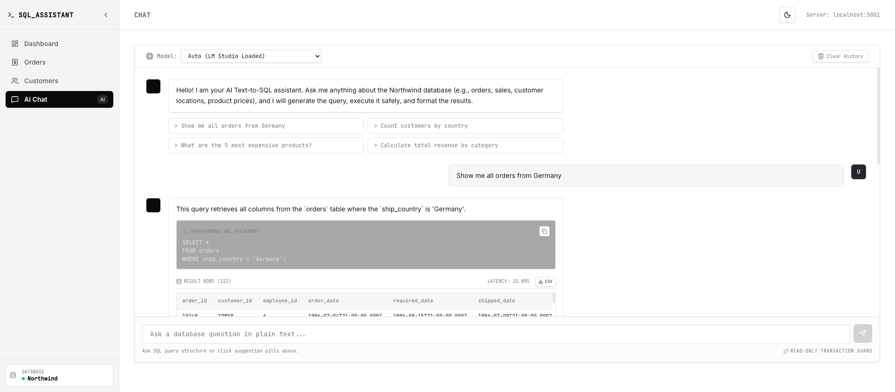
      <p align="left"><i>Select from locally active LLM models and enter questions in natural language.</i></p>
    </td>
    <td align="center" valign="top" width="33%">
      <kbd><b>Step 2: SQL Generation & Explanations</b></kbd><br/>
      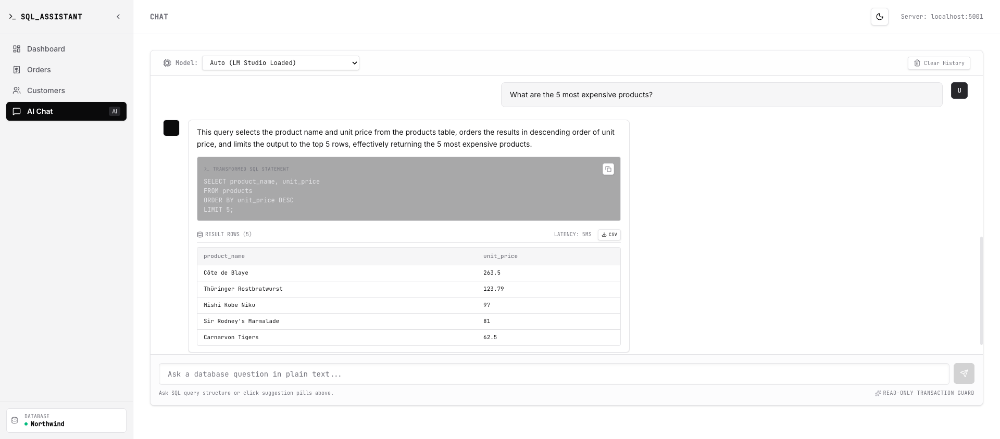
      <p align="left"><i>Real-time token streaming showing thinking steps, SQL translation, and reasoning.</i></p>
    </td>
    <td align="center" valign="top" width="33%">
      <kbd><b>Step 3: Secure Execution Results</b></kbd><br/>
      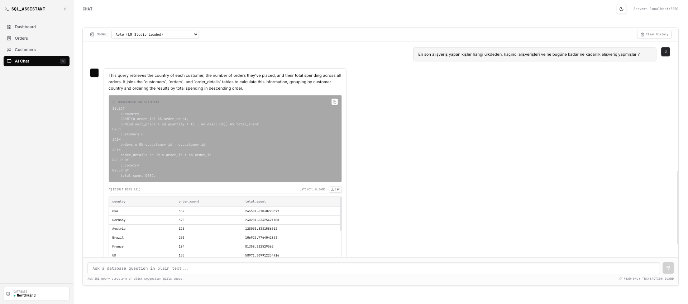
      <p align="left"><i>Execute the generated query securely via server cached tokens and render data dynamically.</i></p>
    </td>
  </tr>
</table>

### 📋 2. AI Chat Multi-Part Executions (Complex Queries)
For longer executions and results that exceed single viewport sizes, the interface scales to display comprehensive datasets.

<table align="center" border="0" cellpadding="5" cellspacing="5" width="100%">
  <tr>
    <td align="center" valign="top" width="50%">
      <kbd><b>Complex Query A: Generated Query</b></kbd><br/>
      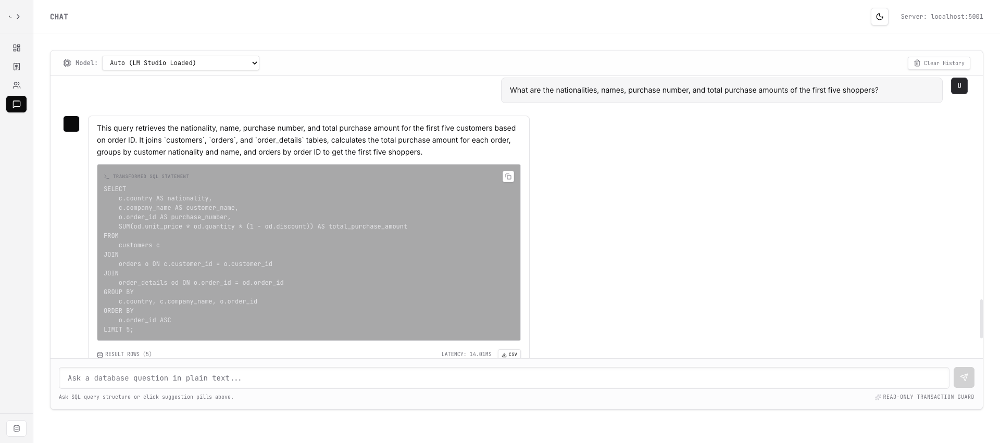
      <p align="left"><i>Part 1: Text-to-SQL logic translating a multi-join data filter.</i></p>
    </td>
    <td align="center" valign="top" width="50%">
      <kbd><b>Complex Query A: Full ResultSet</b></kbd><br/>
      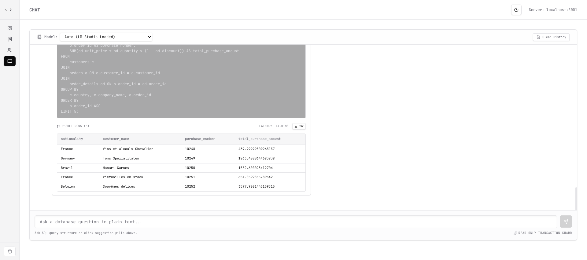
      <p align="left"><i>Part 2: Executed SQL data records formatted into a clean relational grid.</i></p>
    </td>
  </tr>
  <tr>
    <td align="center" valign="top" width="50%">
      <kbd><b>Complex Query B: Generated Query</b></kbd><br/>
      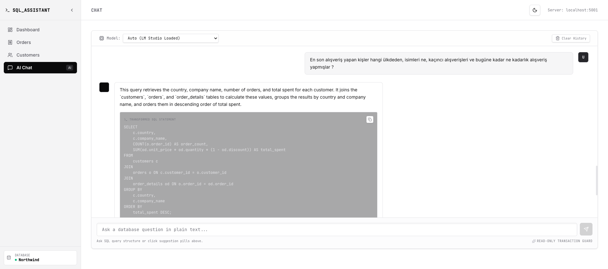
      <p align="left"><i>Part 1: Processing structured aggregates and group filters.</i></p>
    </td>
    <td align="center" valign="top" width="50%">
      <kbd><b>Complex Query B: Full ResultSet</b></kbd><br/>
      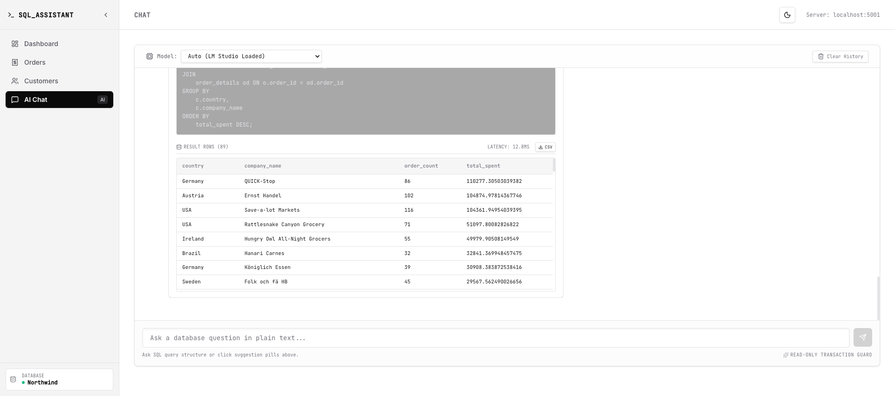
      <p align="left"><i>Part 2: Aggregated data metrics returned from the database tables.</i></p>
    </td>
  </tr>
</table>

### 📊 3. Dashboard & Management Explorers
Standard metrics dashboard and searchable records tables loaded directly from the database endpoints.

<table align="center" border="0" cellpadding="5" cellspacing="5" width="100%">
  <tr>
    <td align="center" valign="top" width="33%">
      <kbd><b>Metrics & Telemetry Dashboard</b></kbd><br/>
      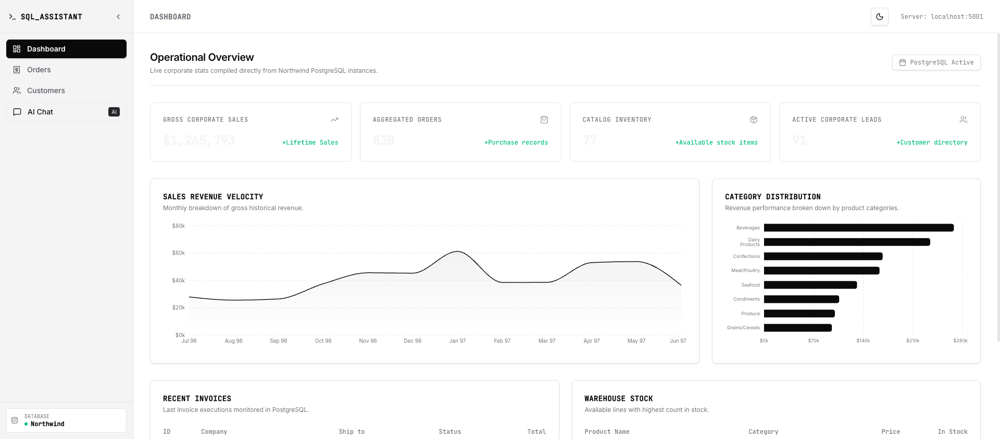
      <p align="left"><i>Dashboard KPIs and sales velocity trends mapping product category performance.</i></p>
    </td>
    <td align="center" valign="top" width="33%">
      <kbd><b>Orders Ledger</b></kbd><br/>
      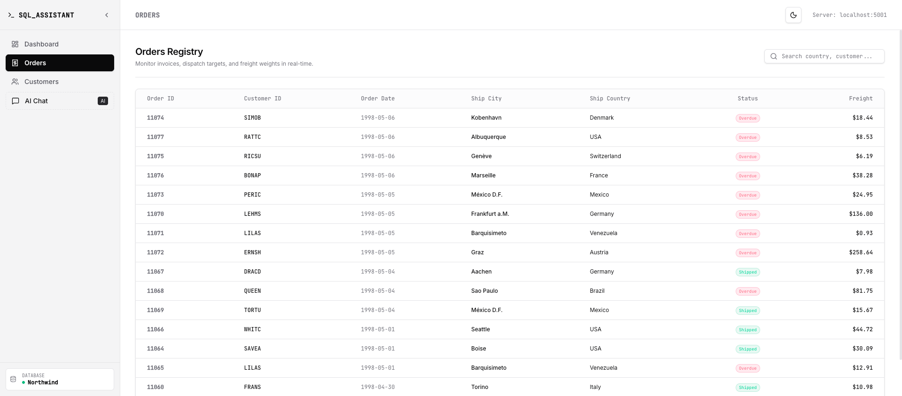
      <p align="left"><i>Paginated list of historical transactions, freight costs, and shipping destinations.</i></p>
    </td>
    <td align="center" valign="top" width="33%">
      <kbd><b>Customers Directory</b></kbd><br/>
      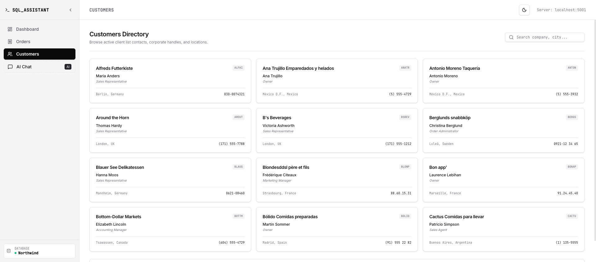
      <p align="left"><i>Searchable directory profiles listing customer contacts, location states, and info.</i></p>
    </td>
  </tr>
</table>

---

## 🛠️ Tech Stack & Services

- **Frontend**: Vite + React 19 + Tailwind CSS v4 + Recharts + Lucide Icons
- **Backend**: Node.js + Express + PostgreSQL Client (`pg`) + Server-Sent Events (SSE)
- **Database**: PostgreSQL 13 (Docker Compose) with PGAdmin interface
- **AI Gateway**: LM Studio (hosting local models via OpenAI-compatible API)

---

## 🏗️ System Architecture

The following diagram illustrates how components communicate securely:

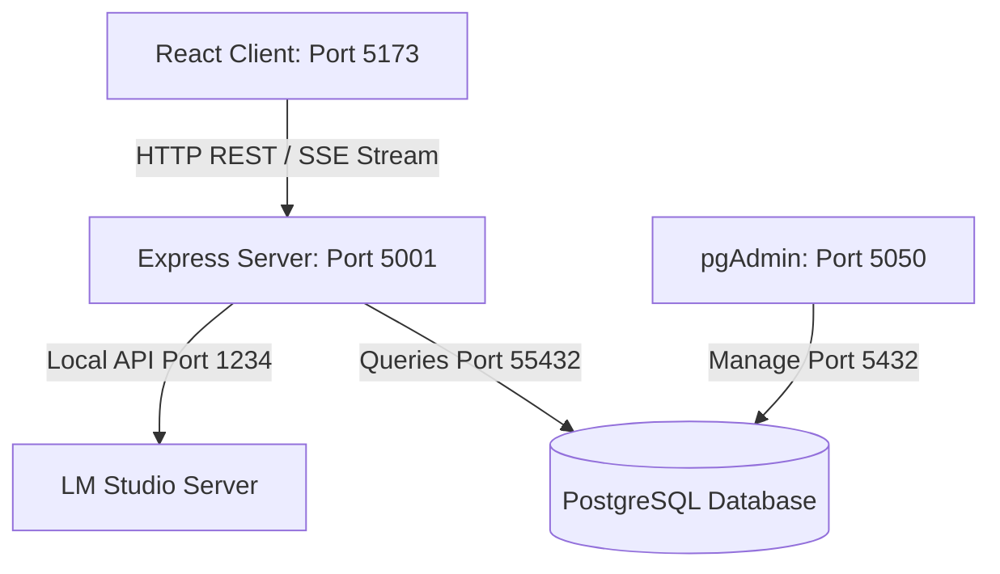

---

## 🔒 Security Architecture (Query Caching)

To prevent arbitrary execution vulnerability (SQL Injection) when executing AI queries:
1. **Streaming & Caching**: When the LLM successfully generates a query, the backend assigns it a cryptographically secure random UUID (`queryId`) and caches the SQL statement server-side with a 10-minute TTL.
2. **Execute Request**: The client requests execution using only the `queryId`. The client *never* sends raw SQL strings to the server.
3. **Restricted Client**: The executor only runs read-only commands (`SELECT` and `WITH` CTEs) and rejects destructive queries (`INSERT`, `UPDATE`, `DELETE`, `DROP`).

---

## 📂 Database Schema Overview

The database contains the classic **Northwind** retail dataset with the following relation schema (Refer to [db/ER.png](db/ER.png) for the full entity relation diagram):

1. **`categories`**: Product category classification.
2. **`customers`**: Client billing and contact profiles.
3. **`employees`**: Internal employee registers.
4. **`orders`**: Transaction parent details (dates, freight, shipping addresses).
5. **`order_details`**: Line items of transactions (quantities, discounts, unit prices).
6. **`products`**: Catalog list with stock counts and pricing.
7. **`suppliers`**: Sourcing entities and locations.
8. **`shippers`**: Shipping agents.

---

## 🚀 Getting Started

Follow these steps to run the complete environment locally:

### 1. Run the Database (Docker Compose)
Ensure Docker is installed and running. Navigate to the `db` directory and boot up the containers:
```bash
cd db
docker-compose up -d
```
*Database will populate tables automatically using `northwind.sql` and expose Postgres on port `55432`.*
*(Optional) Access pgAdmin at [http://localhost:5050](http://localhost:5050) (User/Pass: postgres/postgres).*

### 2. Configure and Start Backend
Open a terminal in the `backend` folder, set up variables, install dependencies, and start:
```bash
cd backend
npm install
npm run dev
```
Verify the `.env` settings:
```ini
PORT=5001
DB_HOST=localhost
DB_PORT=55432
DB_USER=postgres
DB_PASSWORD=postgres
DB_NAME=northwind
```

### 3. Load LLM in LM Studio
1. Open **LM Studio** and download/load your preferred model (e.g., Llama-3, Qwen-2.5-Coder).
2. Start the **Local Server** option inside LM Studio, listening on `http://127.0.0.1:1234`.
3. Keep the server running. The backend communicates with this interface via `http://127.0.0.1:1234/v1/chat/completions`.

### 4. Start Frontend Client
Open a terminal in the `frontend` folder, install dependencies, and run:
```bash
cd frontend
npm install
npm run dev
```
Open [http://localhost:5173](http://localhost:5173) in your browser to interact with the application.

---

## 📄 License

This project is licensed under the MIT License - see the details below:

```text
MIT License

Copyright (c) 2026

Permission is hereby granted, free of charge, to any person obtaining a copy
of this software and associated documentation files (the "Software"), to deal
in the Software without restriction, including without limitation the rights
to use, copy, modify, merge, publish, distribute, sublicense, and/or sell
copies of the Software, and to permit persons to whom the Software is
furnished to do so, subject to the following conditions:

The above copyright notice and this permission notice shall be included in all
copies or substantial portions of the Software.

THE SOFTWARE IS PROVIDED "AS-IS", WITHOUT WARRANTY OF ANY KIND, EXPRESS OR
IMPLIED, INCLUDING BUT NOT LIMITED TO THE WARRANTIES OF MERCHANTABILITY,
FITNESS FOR A PARTICULAR PURPOSE AND NONINFRINGEMENT. IN NO EVENT SHALL THE
AUTHORS OR COPYRIGHT HOLDERS BE LIABLE FOR ANY CLAIM, DAMAGES OR OTHER
LIABILITY, WHETHER IN AN ACTION OF CONTRACT, TORT OR OTHERWISE, ARISING FROM,
OUT OF OR IN CONNECTION WITH THE SOFTWARE OR THE USE OR OTHER DEALINGS IN THE
SOFTWARE.
```

*Note: The underlying database initialization script is based on [pthom/northwind_psql](https://github.com/pthom/northwind_psql) which uses the Microsoft Public License (Ms-PL) detailed in [db/LICENSE](db/LICENSE).*
